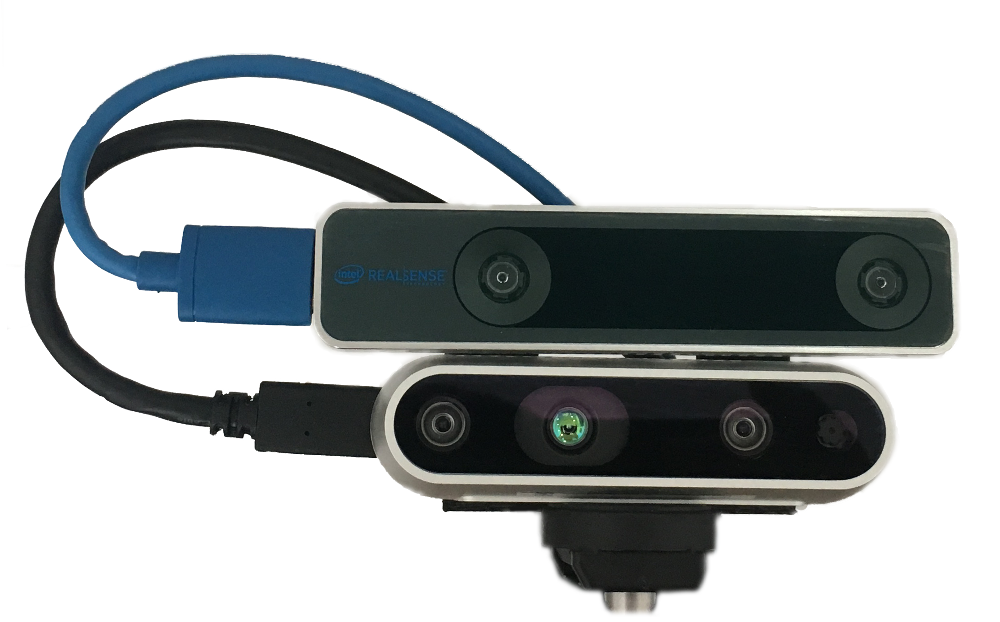
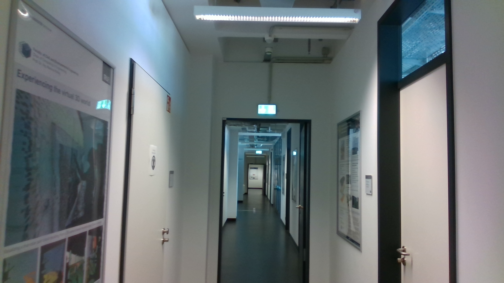
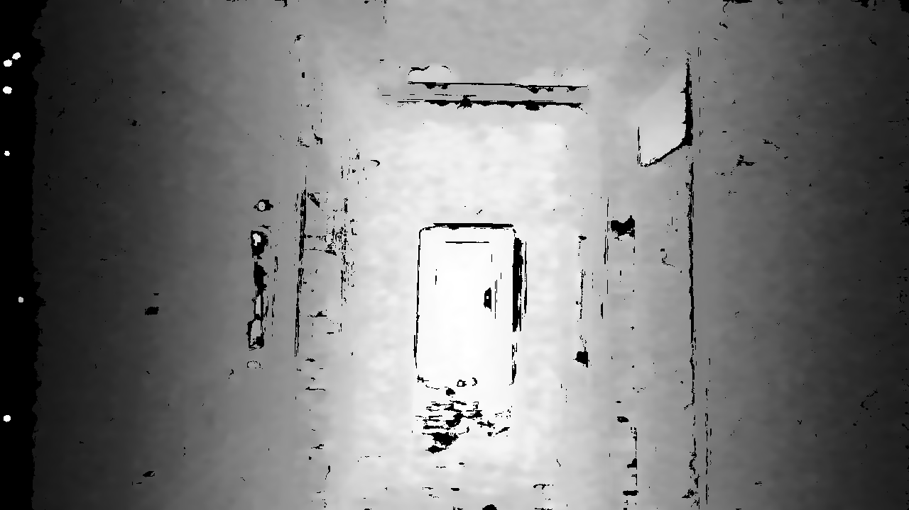
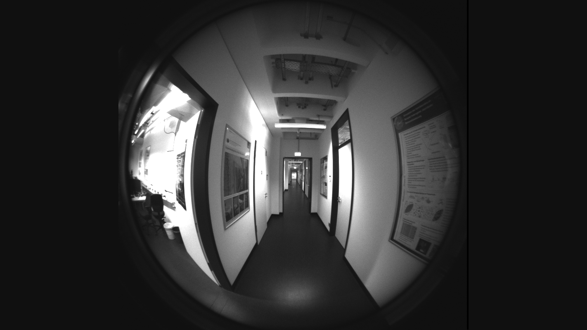
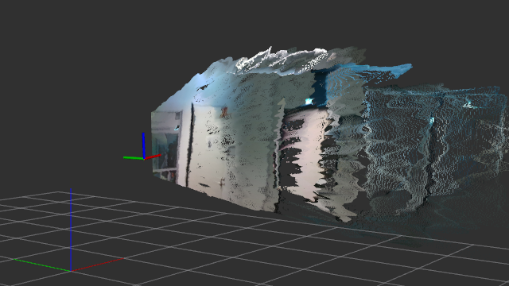
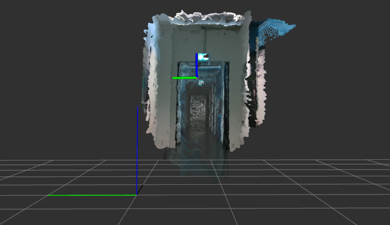

connecting and reading data stream from intel realsense t265 and d435 synchronously.


# some nice images:

t265 mounted over the d435:



real image (d435):



depth image (d435):



fish eye left (t265):



fish eye right (t265):


odometry (t265) + pointcloud (d435):



odometry (t265) + pointcloud (d435):



# some nice informations:

this is a catkin package.

firstly run ```cd <catkin_workspace>```

in your catkin worksapce run ```catkin_create_pkg t265_d435```

copy all files to `<catkin_workspace>/src/t265_d435`

usage is under `scripts/README.md` explained

# known issues:

sometimes there exists frame drops which causes an interrupt and exiting the recording process, while recording and vizualizing via rviz in the same time. 
